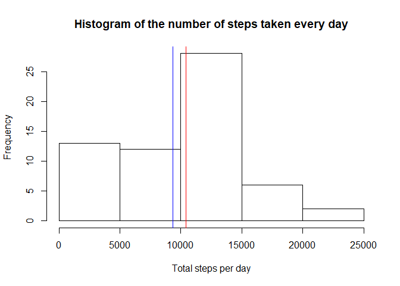
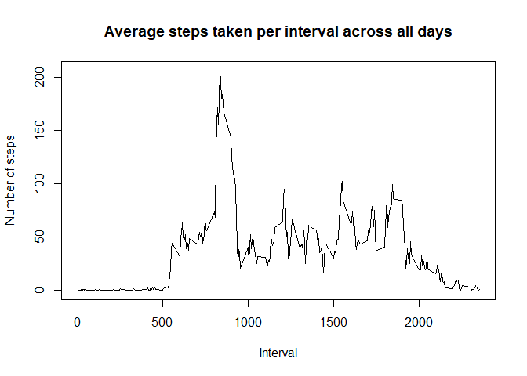
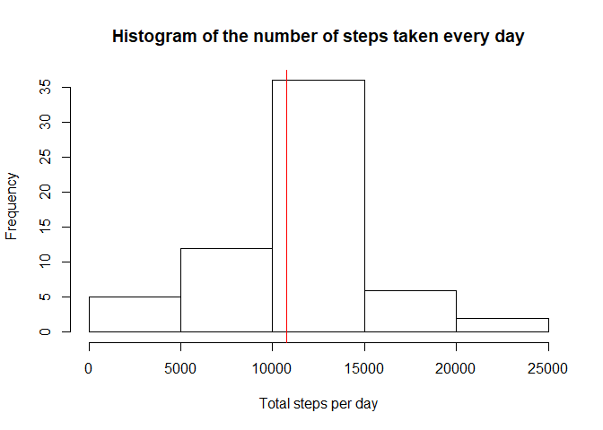
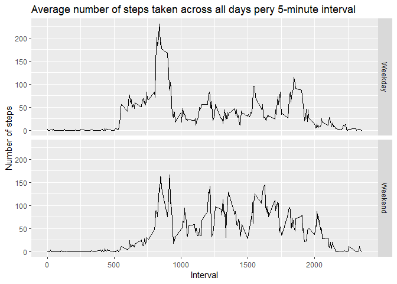

Activity Monitoring Data Assignment
-----------------------------------

### 1. Loading and preprocessing the data

We will start off by loading the data and transforming it into a format
more suitable for analysis.

    data<-read.csv("activity.csv")
    data$date<-as.Date(data$date)

### 2. Mean total number of steps taken per day

We begin by calculating the total number of steps taken per day in the
following manner.

    sumperday<-with(data, tapply(steps, date, sum, na.rm=TRUE))
    sumperday<-as.data.frame(sumperday)
    head(sumperday)

    ##            sumperday
    ## 2012-10-01         0
    ## 2012-10-02       126
    ## 2012-10-03     11352
    ## 2012-10-04     12116
    ## 2012-10-05     13294
    ## 2012-10-06     15420

We now make a histogram of the total number of steps per day and include
the mean and median of the total number of steps per day.

    hist(sumperday$sumperday, xlab = "Total steps per day", main = "Histogram of the number of steps taken every day")
    meansteps = mean(sumperday$sumperday)
    mediansteps = median(sumperday$sumperday)
    abline(v = meansteps, col = "blue")
    abline(v = mediansteps, col = "red")

As seen in the plot above, the mean number of steps is 9354.2295082
(blue) and the median number of steps is 10395 (red).

### 3. Average daily activity pattern

We now plot the 5-minute interval and the average number of steps taken,
averaged across all days.

    intervals<-unique(data$interval)
    intervalaverage<-with(data, tapply(steps, interval, mean, na.rm = TRUE))
    intervalaverage<-as.data.frame(intervalaverage)
    intervalaverage$intervals<-intervals
    plot(intervalaverage$intervals, intervalaverage$intervalaverage, type = "l", main = "Average steps taken per interval across all days", xlab = "Interval", ylab = "Number of steps")

    maxint<-which.max(intervalaverage$intervalaverage)
    maximumint<-intervalaverage[maxint,2]

The 5-minute interval which on average across all the days in the
dataset contains the maximum number of steps is 835.

### 4. Imputing missing values

We start off by calculating the total number of missing values in the
dataset.

    missingvalues<-is.na(data$steps)
    totalmissingvalues<-sum(missingvalues)

In total, we have 2304 missing values in the dataset.

To fill these missing values, we will use the average steps across all
days for the specific interval of the missing value, and create a new
dataset equal to the original dataset but with the missing data filled
in.

    datanew<-data
    vectorlength<-1:length(datanew$steps)

    for (i in vectorlength) {
      if (missingvalues[i] == TRUE) {
        nainterval<-data$interval[i]
        subsetinterval<-subset(intervalaverage, intervals == nainterval, intervalaverage)
        datanew$steps[i]<-subsetinterval[1,1]
      } else {
        datanew$steps[i]<- data$steps[i]
      }
    }

    head(datanew)

    ##       steps       date interval
    ## 1 1.7169811 2012-10-01        0
    ## 2 0.3396226 2012-10-01        5
    ## 3 0.1320755 2012-10-01       10
    ## 4 0.1509434 2012-10-01       15
    ## 5 0.0754717 2012-10-01       20
    ## 6 2.0943396 2012-10-01       25

We now make a new histogram of the total number of steps taken each day
and calculare the mean and median.

    sumperdaynew<-with(datanew, tapply(steps, date, sum))
    sumperdaynew<-as.data.frame(sumperdaynew)
    hist(sumperdaynew$sumperdaynew, xlab = "Total steps per day", main = "Histogram of the number of steps taken every day")
    meanstepsnew = mean(sumperdaynew$sumperdaynew)
    medianstepsnew = median(sumperdaynew$sumperdaynew)
    abline(v = meanstepsnew, col = "blue")
    abline(v = medianstepsnew, col = "red")

The new mean number of steps per day is 1.076618910^{4} while the new
median steps per day is 1.076618910^{4}. The difference in the mean is
1411.959171 and the difference in the median is 371.1886792. The impact
of imputing missing data on the estimates of the total daily number of
steps is an 15.0943396% increase in the mean and an 3.5708387% increase
in the median.

### 5. Activity patterns between weekdays and weekends

To determine whether there are activity patterns between weekdays and
weekends, we first create a new factor variable in the new dataset with
two levels - "weekday" and "weekend".

    datanew$day<-0

    for (i in vectorlength) {
      day<-weekdays(datanew$date[i])
      weekdaysdays<-c("lunes", "martes", "miércoles", "jueves", "viernes")
      if (day %in% weekdaysdays == TRUE) {
        datanew$day[i]<-"Weekday"
      } else {
        datanew$day[i]<-"Weekend"
      }
    }
    datanew$day<-as.factor(datanew$day)
    head(datanew)

    ##       steps       date interval     day
    ## 1 1.7169811 2012-10-01        0 Weekday
    ## 2 0.3396226 2012-10-01        5 Weekday
    ## 3 0.1320755 2012-10-01       10 Weekday
    ## 4 0.1509434 2012-10-01       15 Weekday
    ## 5 0.0754717 2012-10-01       20 Weekday
    ## 6 2.0943396 2012-10-01       25 Weekday

We now make a panel plot containing a time series plot of the 5-minute
interval axis and the average number of steps taken, averaged across all
weekday days or weekend days.

    library(ggplot2)
    intervalsweekdays<-with(datanew, aggregate(steps ~ interval + day, datanew, mean))

    g<- ggplot(intervalsweekdays, aes(interval, steps))
    g<- g + geom_line() + facet_grid(day~.) + ggtitle("Average number of steps taken across all days pery 5-minute interval") + labs(x = "Interval", y = "Number of steps")
    print(g)

